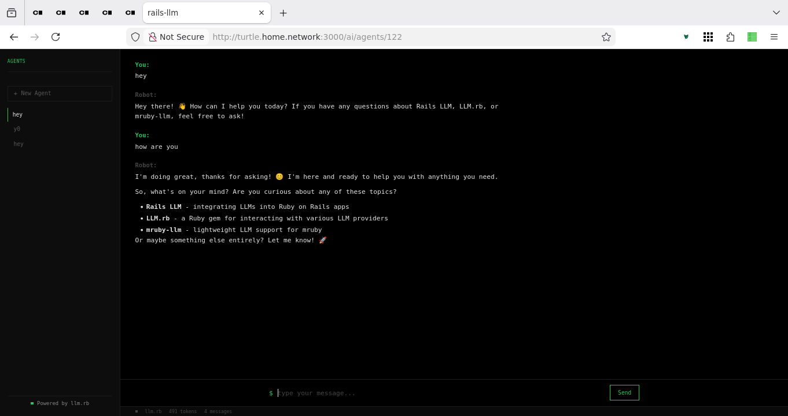

<p align="center">
  <a href="https://github.com/llmrb/rails-llm">
    
  </a>
</p>

<p align="center">
  <a href="https://github.com/llmrb/rails-llm">
    
  </a>
  <a href="LICENSE">
    
  </a>
  <a href="https://github.com/llmrb/llm.rb">
    
  </a>
</p>

## About

This project integrates the [llm.rb](https://github.com/llmrb/llm.rb#readme)
runtime and its features into Rails.

The project extends the builtin ActiveRecord support available to the
[llm.rb](https://github.com/llmrb/llm.rb#readme)
runtime with a Rails integration that includes generators for getting
set up quickly, and an engine for a stream-capable chat interface
that can be extended with your own tools.

The [llm.rb](https://github.com/llmrb/llm.rb#readme) runtime runs on Ruby's
standard library by default. loads optional pieces only when needed, and
offers a single runtime for providers, agents, tools, skills, MCP, A2A (Agent2Agent),
RAG (vector stores & embeddings), streaming, files, and persisted state.

## Quick start

**1. Add to Gemfile**

Add `rails-llm`:

```bash
bundle add rails-llm
```

**2. Run generator**

Generate the model, migration, and routes:

```bash
rails generate rails_llm:install
```

**3. Run migrations**

Migrate the database:

```bash
rails db:migrate
```

**4. Configure your API key**

Set your API key. If you want to use a different provider,
edit `set_provider` in `app/models/rails_llm/agent.rb`.

```bash
export DEEPSEEK_API_KEY=...
```

**5. Profit**

Open your browser:

```bash
open http://localhost:3000/ai/agents
```

## Example

#### acts_as_agent

```ruby
class Agent < ApplicationRecord
  acts_as_agent provider: :set_provider, context: :set_context

  private

  def set_provider
    LLM.deepseek(key: ENV["DEEPSEEK_API_KEY"])
  end

  def set_context
    {model: "deepseek-v4-flash"}
  end
end

agent = Agent.create!
agent.ask("What is the capital of France?").content       # => "Paris"
agent.ask("Summarize this", with: "report.pdf").content   # with a file
agent.ask("Tell me a story") { |chunk| print chunk }      # streaming
```

## Engine

#### Generators

| Generator | What it creates |
|---|---|
| `rails_llm:install` | `RailsLLM::Agent` model, `RailsLLM::KnowledgeTool`, migration (`rails_llm_agents`), initializer, engine routes |
| `rails_llm:model` | `RailsLLM::Agent` model with `acts_as_agent` |

#### Engine routes

| Method | Path | Action |
|---|---|---|
| GET | `/ai/agents` | List agents |
| GET | `/ai/agents/:id` | View an agent |
| POST | `/ai/agents` | Create a new agent |
| POST | `/ai/agents/:id/ask` | Send a message |)

#### Screenshot



## License

[BSD Zero Clause](LICENSE)
